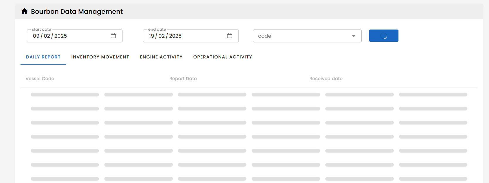
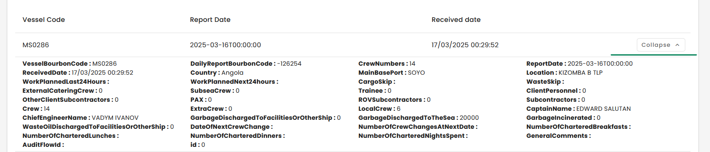

# V-data-table

## sources
Opsealog -> project Bourbon Data API

### Skeleton loader (loading slot)

----



````html
  <v-data-table :loading="loading" >
        <template v-slot:loading>
           <v-skeleton-loader type="table-row@10"></v-skeleton-loader>
        </template>
````
### Expand row

property show-expand, automatically add column to carry expand/collapse button  

---


````html
 <v-data-table  show-expand  >
        <template v-slot:item.data-table-expand="{ internalItem, isExpanded, toggleExpand }" >
            <v-btn :append-icon="isExpanded(internalItem) ? 'mdi-chevron-up' : 'mdi-chevron-down'"   :text="isExpanded(internalItem) ? 'Collapse' : 'More info'"
                   class="text-none"
                   color="medium-emphasis"
                   size="small"
                   variant="text"
                   border
                   slim
                   @click="toggleExpand(internalItem)"
            ></v-btn>
        </template>
        <template v-slot:expanded-row="{ columns, item }">
            <tr>
                <td :colspan="columns.length" class="py-2">
                    <expand-table :item="item" :category-header="categoryHeader"></expand-table>
                </td>
            </tr>
        </template>
    
    </v-data-table>


````
Another example with slot:item (Opsealog -> bourbon data management)
