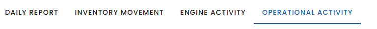

# v-tabs

#### 1. Mapping v-tabs with a collection

---



```html
    <v-tabs v-model="tab" color="primary">
        <v-tab v-for="(item, index) in categories" :key="index" :text="item.text"  :value="item.value"></v-tab>
    </v-tabs>
```
```js
setup(){
        const categories = [
            { value : "BourbonDailyReport", text :"Daily Report"},
            { value : "BourbonInventoryMovement", text :"InventoryMovement"},
            { value : "BourbonEngineActivity", text :"Engine Activity"},
            { value : "BourbonOperationalActivity", text :"Operational Activity" }]
        return {categories}
    },
    data(){
        return {category : null}
    }
```
