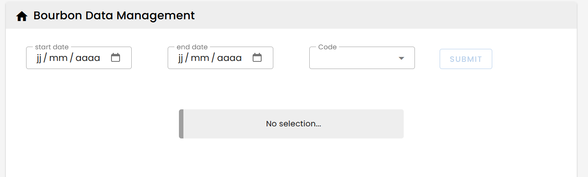

### Example : center an alert

---


````html
<v-sheet class="text-center"  v-if="reset">
    <v-alert border style="width: 400px; margin: 50px auto"  >
    No selection...
    </v-alert>
</v-sheet>
````
