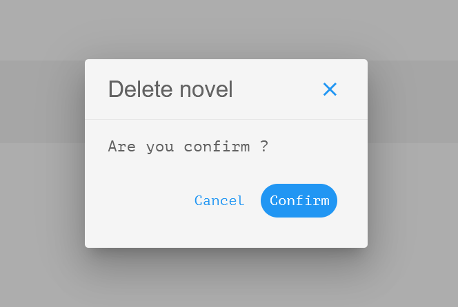

# v-dialog



Source : PnlApp

````html
  <v-dialog v-model="show" max-width="300">
    <v-card>
      <v-card-title class="d-flex justify-space-between align-center">
        <div class="text-h5 text-medium-emphasis ps-2">
          Delete novel
        </div>
        <v-btn   icon="mdi-close" variant="text"  @click="show= false" ></v-btn>
      </v-card-title>
      <v-divider></v-divider>
      <v-card-text>
        <div class="text-medium-emphasis mb-5">Are you confirm ?</div>
        <v-card-actions class="d-flex justify-end">
          <v-btn class="text-none" rounded="xl" text="Cancel" @click.prevent="show =false" ></v-btn>
          <v-btn class="text-none" color="primary" rounded="xl" text="Confirm" variant="flat" @click.prevent="deleteFn(id)" ></v-btn>
        </v-card-actions>
      </v-card-text>
    </v-card>
  </v-dialog>
````
