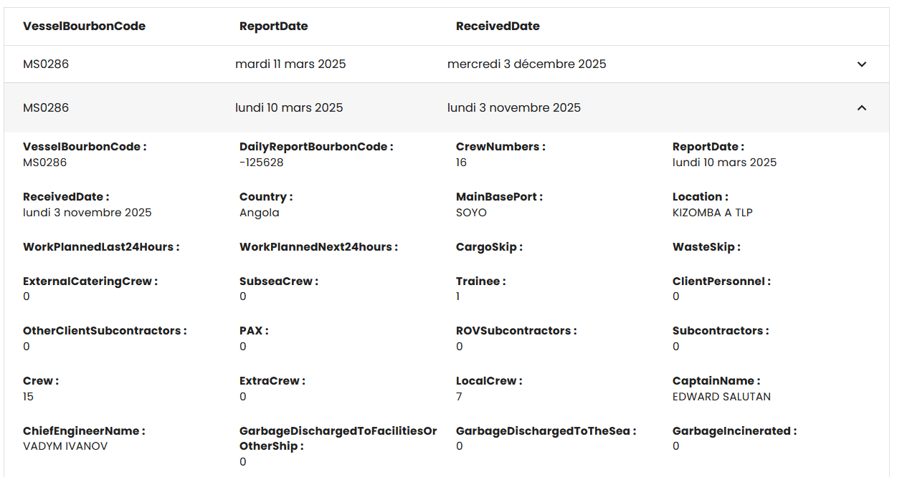

# vExpand

---

VExpand responsive



````html
<v-expansion-panels  elevation="0"  class="border mt-4" variant="accordion"  >
    <v-expansion-panel >
        <v-expansion-panel-title class="font-weight-bold"    hide-actions>
            <v-row>
                <v-col cols="12" md="4" lg="3"  v-for="(header, index) in categoryHeader" :key="index" >{{header}}</v-col>
            </v-row>
        </v-expansion-panel-title>
    </v-expansion-panel>
    <v-expansion-panel v-for="(row, index) in listFilter" :key="index">
        <v-expansion-panel-title >
            <v-row>
                <v-col cols="12" md="4" lg="3" v-for="(category, index) in categoryHeader" :key="index"  >{{getHeaderValue(category,row)}}</v-col>
            </v-row>
        </v-expansion-panel-title>
        <v-expansion-panel-text>
            <v-row>
                <v-col cols="12" md="4" lg="3" v-for="(cell, index) in getContent(row)" :key="index" >
                    <strong>{{cell.key}} : </strong><br>{{cell.value}}
                </v-col>
            </v-row>
        </v-expansion-panel-text>
    </v-expansion-panel>
</v-expansion-panels>
````
