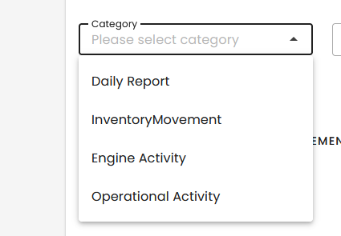

# v-select

1. Mapping v-select with a collection



```
<v-select variant="outlined" density="compact" label="Category" v-model="category" item-title="text" :hint="category" placeholder="Please select category" :items="categories"></v-select>
 setup(){
        const categories = [
            { value : "BourbonDailyReport", text :"Daily Report"},
            { value : "BourbonInventoryMovement", text :"InventoryMovement"},
            { value : "BourbonEngineActivity", text :"Engine Activity"},
            { value : "BourbonOperationalActivity", text :"Operational Activity" }]
        return {categories}
    },
       data(){
        return {category : null}
    }
```
