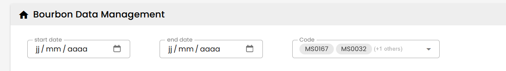
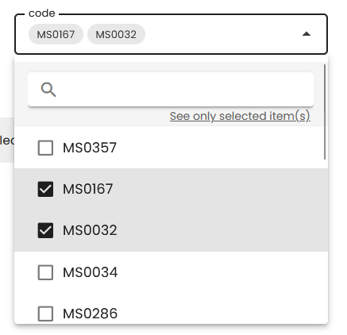
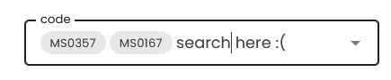

# v-select

#### 1. Mapping v-select with a collection

---


```html
<v-select variant="outlined" density="compact" label="Category" v-model="category" item-title="text" :hint="category" placeholder="Please select category" :items="categories"></v-select>
 
```
```js
setup(){
        const categories = [
            { value : "BourbonDailyReport", text :"Daily Report"},
            { value : "BourbonInventoryMovement", text :"InventoryMovement"},
            { value : "BourbonEngineActivity", text :"Engine Activity"},
            { value : "BourbonOperationalActivity", text :"Operational Activity" }]
        return {categories}
    },
    data(){
        return {category : null}
    }
```

### multi-select chips



```html
<v-select variant="outlined" density="compact" label="Code" class="mx-5" multiple v-model="filter.bourbonVesselCodes" placeholder="Please select code" :items="codeList">
    <template v-slot:selection="{ item, index }">
    <v-chip v-if="index < 2" :text="item.title"></v-chip>
        <span v-if="index === 2"  class="text-grey text-caption align-self-center" >
            (+{{ filter.bourbonVesselCodes.length - 2 }} others)
        </span>
    </template>
</v-select>
```
Note: vuetify documentation have a part slot with #slotname refer to `v-slot:selection`

### Example of search select

---

1. search bar separate
2. chips
3. filter only by items selected



template
````html
  <v-select label="code"  :items="filteredCodes" v-model="filter.bourbonVesselCodes" multiple variant="outlined"  density="comfortable" >
                         <template v-slot:prepend-item>
                              <v-list-item class="bg-grey-lighten-4 pb-0 position-relative">
                                  <v-text-field class="mt-2" @focus.stop="stopEventPropagation" :disabled="onlySelected" v-model="search" density="compact" :variant="onlySelected ? 'outlined' : 'solo' " prepend-inner-icon="mdi-magnify">
                                    </v-text-field>
                                  <a href="#" v-if="filter.bourbonVesselCodes.length>0" title="filter by selected item(s)" @click.prevent="toggleSelected" class="position-absolute text-grey-darken-2" style="bottom:0;right:20px">
                                    <small>See <template v-if="onlySelected">all </template><template v-else>only selected </template>item(s)</small>
                                  </a>
                              </v-list-item>
                              <v-divider class="pt-0" ></v-divider>
                        </template>
                          <template v-slot:chip="{ item, index }">
                              <v-chip v-if="index < 2" :text="item.title"></v-chip>
                              <span v-if="index === 2"  class="text-grey text-caption align-self-center" >
                                (+{{ filter.bourbonVesselCodes.length - 2 }} others)
                              </span>
                        </template>

                    </v-select>
````
script
````js
watch : {
    'filter.bourbonVesselCodes.length' : {
        handler(value){
            if(value===0){
                this.onlySelected = false
            }
        }
    }
},
computed : {
    filteredCodes() {
        if(this.onlySelected){
            return this.codeList.reduce((list, row)=>{
                if(this.filter.bourbonVesselCodes.includes(row)){
                    list.push(row)
                }
                return list
            },[])
        }else{
            return this.search === '' ?  this.codeList : this.codeList.filter(x=> x.toLowerCase().indexOf( this.search.toLowerCase())>-1)
        }
    }
},
methods : {
    stopEventPropagation(){
        return false
    },
    toggleSelected(){
        this.onlySelected = ! this.onlySelected
    },
}

````

### Issue about UI search with v-combobox and v-typeahead

---

v-combobox and v-typeahead, merge chips selected & search input focus in the same textfield, it's missunderstanding


