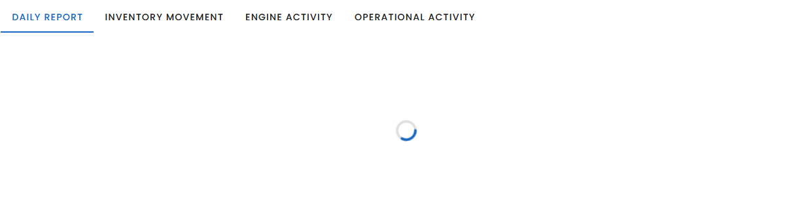

# v-sheet

---

- This is a foundational component. Think of it as a basic "piece of paper" in the Material Design sense.
    - It provides core styling features like **_elevation (shadows)_**, rounded corners, and background control.
    - It's designed to be a **_low-level_** component, meaning it's often used as a building block for other, more complex components.
    - It's ideal when you need a **_simple_**, customizable *container* with basic Material Design styling.




```html
<v-sheet height="300" class="d-flex align-center justify-center">
      <v-progress-circular color="primary"  indeterminate></v-progress-circular>
</v-sheet> 
```
